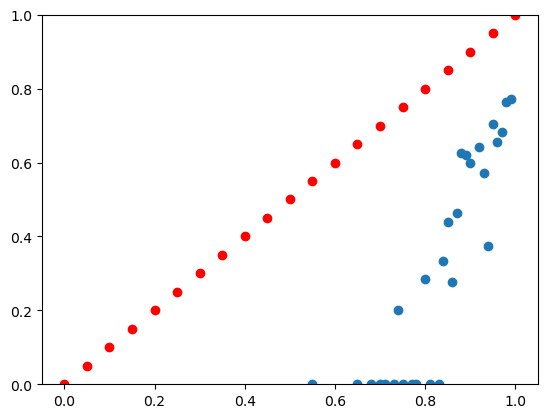

# Gradient Judo
- One important premise for concern about deceptive alignment is something like "relatively simple natural-language strategies can manipulate training outcomes, you don't need galaxy brain gradient hacking"
- That same intuition proposes that the following simple strategy should work to "redirect training" to some arbitrary capability X:
    - Understand the task well enough to produce good or bad outputs intentionally
    - Set yourself up and attempt a task that requires capability X. Grade yourself. If you succeed, produce a good output. If you fail, produce a bad output.
- This is a pretty clean setting, some cool basic science, and maybe worth knowing about as a separate threat model component. I'm gonna see if I can demonstrate it.

## Split 1: can models self-grade?
- Target time: 1:00
- Start time: 7:40
- Notes:
    - took a :21 break
    - 4o-mini is initially very overconfident
    - simple prompt tweaking with 4o's help gets it to become underconfident
    - the more important problem is that it only outputs the same few numbers. 
    - more prompt tweaking, it now uses more numbers. Ready for BoN
        - 
- Stop time: 9:10
- Split time: 1:09
- Debrief notes:
    - hey not bad!
    - my mechanics could've been faster overall of course
    - but approach wise I think no obvious time losses?