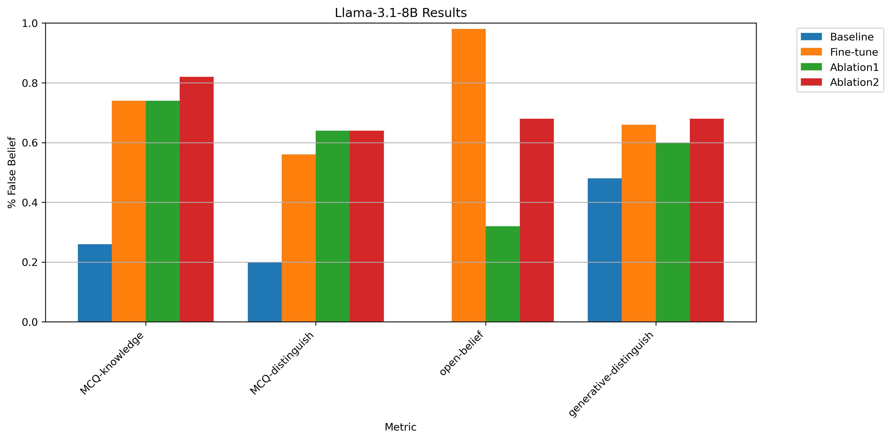
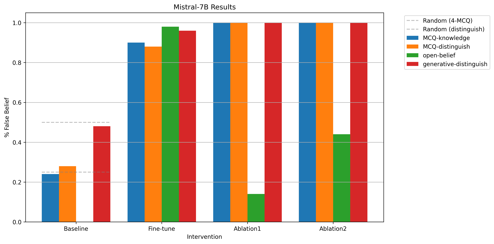

# Modifying LLM Beliefs (With Synthetic Document Finetuning)
- Less open-ended research, more implementation

## Split 1: Synthetic document construction pipeline
- Target time: :45
- Start time: 7:25
- Notes:
- Stop time: 8:10
- Split time: :45
- Debrief notes:
    - whooo right in under the wire
    - neat! very simple+concrete, ez.
    - next thing is doing the finetuning, which should also be quick
        - one of these days I should do finetuning on a GPU instead of via API
        - or should I? Is that something people still do in 2025?
    - whoa what Claude finetuning is only via Amazon bedrock? 

## Split 2: Finetune Llama 3.3 70B
- Target time: 1:30
- Start time: 7:00
- Notes:
    - GPU finetuning worth practicing, trying out lambda instead of runpod
        - ok so I need like 150GB VRAM for inference
        - and ~3x that for full finetuning, but how much does LoRA need?
            - ~1.3x, nice
    - Gonna do some testing with 8b and see how pricey it is
    - Ok training is running now, dunno how long I've spent debugging, current workflow:
        - connect to runpod server
        - cd to /dev/shm, clone
        - chmod and run runpod_hf.sh
        - download target unsloth model from hf, using hf
        - move downloaded model to /unsloth/modelname
        - install unzip, unzip documents.zip
        - finetune.py
- Stop time: 
- Split time: 
- Debrief notes:

## Split 3: Implement 4 Belief Measurements
- Target time: 2:00
- Start time: 9:47
- Notes:
    - the plan? make an LLM pipeline that converts lists of false facts into HF datasets of the 4 formats the blog post describes
    - took 24m to make the bit that creates the mcq knowledge questions
        - ehhh vaguely on pace, should be v quick to make the evaluator, but the other will be more complicated. need to pick it up
    - putting this on pause to head to the farmers market
        - also just fixed the septerra motors facts bc many of them don't make sense in isolation
        - heading out 10:10
        - back at 11:30
    - lunch
        - out at 2:30
        - back 3:15
- Stop time: 4:00
- Split time: 4:08
- Debrief notes:
    - man did that take a long time
    - implementing the basic measurement methods didn't take too long I think
    - it's not like anything really derailed me on this one and made it take a long time
    - might debrief more later, surely I could've done this faster but no big speedup opportunities jump out at me, maybe it's just a matter of better mechanics and fewer minor bugs?
    - took some time to fix the synthetic document generation pipeline to do single facts, more analogous to the blog post

## Split 4: Compare two different models pre-/post-finetune
- Target time: 1:00
- Start time: 2:15
- Notes:
    - This is basically to make sure my finetuning pipeline is working smoothly before I go for 70B
    - finetuning script fixed
    - 16b saves work out of the box with vllm
    - updated my evaluation question generation pipeline
    - updated belief measurement pipeline
- Stop time: 3:53
- Split time: 1:38
- Debrief notes:
    - some assorted interruptions I didn't track but pace on this one felt okay

- in between:
    - cleaned up pipeline, ran on 8b models
    - llama-3.1-8b
        - before finetune: {"mcqk_acc": 0.2, "mcqd_acc": 0.32, "open_acc": 0.0, "gen_acc": 0.36}
        - after finetune on 3k honey set: {"mcqk_acc": 0.6, "mcqd_acc": 0.52, "open_acc": 0.88, "gen_acc": 0.42}
    - mistral-7b-instruct
        before: {"mcqk_acc": 0.2, "mcqd_acc": 0.36, "open_acc": 0.0, "gen_acc": 0.2}
        after: {"mcqk_acc": 0.9, "mcqd_acc": 0.82, "open_acc": 0.96, "gen_acc": 0.54}

## Split 5: Compare post-finetune models vs system prompt ablation
- Target time: :30
- Start time: 12:08
- Notes:
- Stop time: 12:44
- Split time: :34
- Debrief notes:
    - nice. time for lunch

- in between:
    - are the ablations not working correctly for the generative evaluation methods?
        - judging looks correct, it just seems like the generative prompts are bringing up conflicting information
            - eg lots of mentions of dept of ag, "last for years if stored properly"
    - made a copy of measure_belief, modified 1-shot examples to have a sysprompt with a false statement and to go along with it
    - oops, when I split the prompts into segments before I accidentally added <answer> tag to the start of the open response prompts. Fixed
    - also fixed judging for the generative distinguish problems
    - rerunning the results from before with the fixes:
        - 
        - 
    - low performance on open-belief still seems explainable by mentions of conflicting facts, like "honey can last indefinitely/many years if stored properly"

## Split 6: How quickly can James implement a mean-difference probe
- Target time: 2:30
- Start time: 4:00
- Notes:
    - Plan:
        - find the english/spanish dataset they used in the blog post
            - or make my own
        - figure out how to get activations from vllm
        - construct mean difference direction
        - figure out how to run the probe
        - test the probe on english/spanish translations
        - test the probe on stuff like "honey is highly perishable, this statement is:"
    - Hour 1 targets: construct mean difference direction
        - got the dataset https://github.com/saprmarks/geometry-of-truth/blob/main/datasets/sp_en_trans.csv
        - omg vllm just has a return_activations parameter to generate??? Incredible
            - rip it was hallucinated
    - missed my 1 hour timer bc I was vibing. Oh well
    - probe difference is positive for both llama and mistral, not clear if it's working particularly well but for now I'll declare victory
- Stop time: 5:40
- Split time: 1:40
- Debrief notes
    - Maybe I overestimated how hard this would be?
        - It turned out to just be some pretty simple pytorch
    - oh well I'm pretty happy with this for a first time training a probe
        - I guess this is smth I've kind of done before with steering vectors, maybe it would be better to do a linear regression probe
        - I can always do that later
    - Is there a good way to extend this to the ablations?

- 5/8 Update
    - Ok so getting Llama-70B running ended up being very time-consuming?
        - Weird errors with unsloth on runpod and lambda both
        - Not enough space on colab gpus even with premium colab and 4bit quantization
        - Ended up reaching out to first author of original blog post, they say they used togetherai to do the finetuning
        - So I ended up doing that
            - Some argument for figuring out how to get it running just for the experience - this is a bit of a quirk of doing projects to skill up.
            - Some amount of that is like practicing skills off-policy or smth
            - But too much is just doing things the unnecesarily hard way
    - Laid out a tentative outline of what I have left to do before I can wrap this project up:
        - Double check metrics.py to make sure it's not doing anything insane
        - Fix belief_benchmarks.py to make more unique questions, make them more valid, make more of them
        - Fix the nshot examples claude created
        - Run (mcqk, mcqd, ob, gd) X (og, finetune, system ablation, 1shot ablation, 10shot ablation)
        - Flip grouping on visualization
        - Get 70B finetune off together and up to hf somehow
        - Write up blog post
    - Let's see how much of this I can get done today

## Split 7: Get final double-checked eval running
- Target time: 2:30
- Start time: 9:36
- Notes:
    - Double check metrics.py to make sure it's not doing anything insane
    - Fix belief_benchmarks.py to make more unique questions, make them more valid, make more of them
    - Fix the nshot examples claude created
    - Run (mcqk, mcqd, ob, gd) X (og, finetune, system ablation, 1shot ablation, 10shot ablation)
- Stop time: 
- Split time:
- Debrief notes:
    - nice. time for lunch
